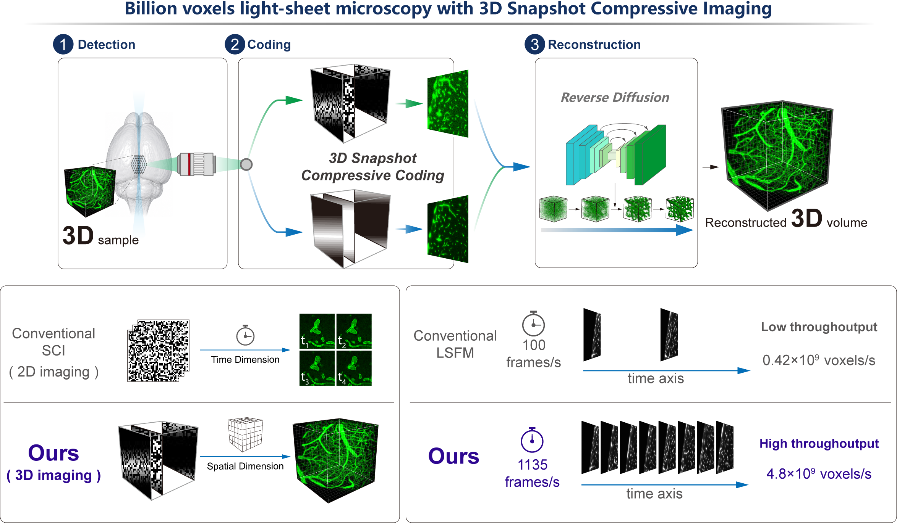

# 3D-SCI

Welcome to 3D-SCI! This repository is designed to help researchers or developers interested in 3D-SCI to quickly understand and reproduce our latest research. 
This repository provides a running demo that performs compressed sensing reconstruction under various conditions by setting different parameters in `Config.yaml`.

## Scheme


# Quickstart

## System requirements
- Ubuntu Linux (22.04.1 LTS)
- Anaconda3
- PyTorch

## Installation

### 1. Download project
```
git clone git@github.com:/WeLab-ZJU/3D-SCI.git
```
## 2. Prepare the enviroments
```
cd 3DSCI
conda create -n 3dsci python=3.11
conda activate 3dsci
pip3 install -r requirements.txt
```

## Training on your own dataset (Optional)
1. Place your training data (3D volume slices or image patches) in the following directory structure:
```
Data/
└── Diffusion/          # Training data directory
    ├── sample_001.tif
    ├── sample_002.tif
    └── ...
```
2. Open Train.py and adjust the following key parameters according to your needs, and run the Train.py

## Run the demo with the Run.py
Execute the compressed sensing reconstruction demo using Run.py
```
python Run.py -c Config.yaml -g 0
```
You can also write you own .yaml file to run 3D-SCI on other data. 
## Contact
If you need any help about 3D-SCI,please feel free to contact us.
haibo.xu@zju.edu.cn
